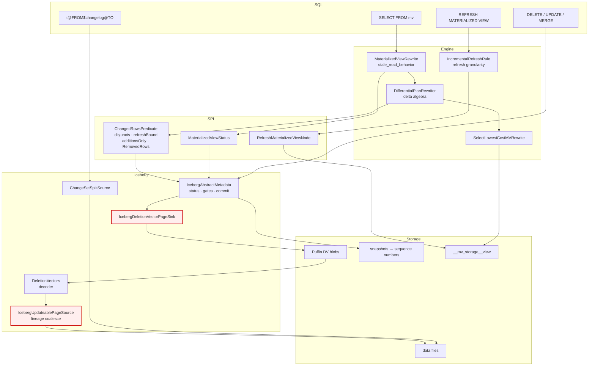

# Row-level incremental MV refresh — architecture

Branch `mv-row-level-incremental-refresh`. Diagrams reflect the code as committed, including
three known defects, marked **[BUG-n]** and listed at the end.

---

## 1. Layer stack

```
┌─ SQL surface ─────────────────────────────────────────────────────────────────────────┐
│  SELECT … FROM mv                    REFRESH MATERIALIZED VIEW mv                     │
│  DELETE / UPDATE / MERGE (V3 base)   TABLE(system.builtin.changes(…))   [BUG-2]       │
│  SELECT … FROM "t@FROM$changelog@TO"                                                  │
└───────────────────────────────────────────────────────────────────────────────────────┘
                │                          │                          │
                ▼                          ▼                          ▼
┌─ Engine: optimizer rules  (presto-main-base …/rule/materializedview/) ────────────────┐
│                                                                                       │
│  MaterializedViewRewrite ......... policy: FAIL | USE_VIEW_QUERY | USE_STITCHING       │
│  DifferentialPlanRewriter ........ mechanism: the delta algebra (2,454 lines)          │
│  IncrementalRefreshRule .......... policy: may a REFRESH go row-level?                │
│  SelectLowestCostMVRewrite ....... chooses among candidates, warns on reject           │
│  RowLevelRefreshEnablement ....... session property ∧ view property                   │
└───────────────────────────────────────────────────────────────────────────────────────┘
                │                                                    ▲
                │ asks                                               │ answers
                ▼                                                    │
┌─ SPI  (presto-spi) ───────────────────────────────────────────────────────────────────┐
│  MaterializedViewStatus                                                               │
│    ├── getPartitionsFromBaseTables() ....... partition-level staleness                │
│    ├── getChangedRowsPredicates() .......... row-level staleness                      │
│    ├── hasPartitionRefreshData()  /  hasRowLevelChanges()                             │
│  ChangedRowsPredicate                                                                 │
│    ├── dataDisjuncts ....... TupleDomains selecting changed rows (seq-number bounds)  │
│    ├── refreshBound ........ refresh-only cap; never applied to a read                │
│    ├── additionsOnly ....... may a materialized row be left in place?                 │
│    └── RemovedRows ......... where to read what the range took away (may be absent)   │
│  ConnectorRefreshMaterializedViewHandle · RefreshMaterializedViewNode                 │
│  MVRewriteCandidatesNode · MaterializedViewStaleReadBehavior · ChangeKindPageSource   │
└───────────────────────────────────────────────────────────────────────────────────────┘
                │                                                    ▲
                ▼                                                    │
┌─ Iceberg connector  (presto-iceberg) ─────────────────────────────────────────────────┐
│                                                                                       │
│  IcebergAbstractMetadata                                                              │
│    ├── getMaterializedViewStatus ── collectChangedPartitions   (APPEND/REPLACE only)  │
│    │                             └─ ChangedRowsPredicate from sequence numbers        │
│    │                                ├── isAppendOnlyRange                             │
│    │                                ├── removalsAreRecoverable                        │
│    │                                └── removedRowsSource → "t@FROM$changelog@TO"     │
│    ├── beginDelete / beginUpdate / beginMerge ..... per-operation version gates        │
│    └── finishWrite / finishDeleteWithOutput ....... RowDelta, retires old vectors      │
│                                                                                       │
│  changelog/                          delete/                                          │
│    ChangeSetSplitSource               DeletionVectors ............ blob decoder        │
│    ChangelogSplitSource               IcebergDeletionVectorPageSink                    │
│    ChangelogUtil                      IcebergDeletionVectorWriterFactory               │
│                                       IcebergDeletePageSink ...... V2 positional       │
│                                                                                       │
│  IcebergPageSourceProvider ..... DV read · sink switch · row-id dispatch · write schema│
│  IcebergUpdateablePageSource ... lineage coalesce · updateRows carry · $row_id struct  │
│  IcebergMergeSink + IcebergMergeTableHandle ... DV on V3, seeded from vectors-in-effect│
│  IcebergPageSink ............... data files (+ _row_id when the write schema carries it)│
└───────────────────────────────────────────────────────────────────────────────────────┘
                │
                ▼
┌─ Storage (Iceberg 1.10.1) ────────────────────────────────────────────────────────────┐
│  base table: data files (Parquet) · Puffin deletion-vector blobs · manifests          │
│              snapshots  →  sequence numbers  →  row lineage (_row_id, _last_updated…)  │
│  MV storage table: __mv_storage__<view>                                               │
└───────────────────────────────────────────────────────────────────────────────────────┘
```

---

## 2. Flow A — stale read (stitching)

The read path. Handles **appends and removals**.

```
SELECT … FROM mv
   │
   ▼
MaterializedViewScanNode
   │
   ▼
MaterializedViewRewrite            ── reads materialized_view_stale_read_behavior
   ├── FAIL ................................. reject the query
   ├── USE_VIEW_QUERY ....................... full recompute from base
   └── USE_STITCHING
         │
         ├── fully fresh ? ................... read __mv_storage__ directly
         ├── partially stale ? ............... stitch  ↓
         └── otherwise ....................... full recompute
                    │
                    ▼
        getMaterializedViewStatus(connector)
                    │
        ┌───────────┴────────────┐
        ▼                        ▼
 partition staleness      ChangedRowsPredicate
 (changed partitions)     (_last_updated_sequence_number > watermark)
        │                        │
        └───────────┬────────────┘
                    ▼
        DifferentialPlanRewriter.buildStitchedPlan
                    │
   per TableScan, three variants:
        delta      = rows the range changed      (predicate pushed into the scan)
        current    = the table as it stands
        unchanged  = the complement
                    │
   propagated up the plan tree:
        Filter, Project ........... pass through
        Join (INNER only) ......... ∆(A⋈B)
        Union / Intersect / Except  set algebra
        Aggregation ............... Case A: γ(∆R)          ← needs the stale boundary
                                            over grouping columns; unreachable for
                                            row-level, whose delta is bounded by a
                                            sequence number
                                    Case B: expand the delta back to whole groups
                                            via semi-join    ← what row-level takes
        Sort / Limit / TopN ....... refused (a union of subsets is not globally ordered)
                    │
   if the range removed rows:
        removed-rows branch ← "t@FROM$changelog@TO"
        affected_identifiers = DISTINCT(from_current_base ∪ from_removed_rows)
        fresh branch ANTI JOIN affected_identifiers   ← so a group is not counted twice
                    │
                    ▼
        MVRewriteCandidatesNode  →  SelectLowestCostMVRewrite  →  chosen plan
                                          │
                                          └── row-level lost on cost → warning
```

**Plan markers that prove row-level fired** (vs partition-level): `_last_updated_sequence_number`
at the base scan, `LeftJoin` for the anti-join, `IS_NULL(affected)`, and `IS DISTINCT FROM` for
null-safe identifier matching.

---

## 3. Flow B — refresh

The write path. **Append-only at both granularities.**

```
REFRESH MATERIALIZED VIEW mv
   │
   ▼
IncrementalRefreshRule
   │
   │   row-level requires ALL of:
   │     status.hasRowLevelChanges()
   │     status.hasPartitionRefreshData()   ← partition staleness is a PRECONDITION
   │     !rangeRemovedRows                  ← any removal declines
   │     RowLevelRefreshEnablement.isEnabled(session, view)
   │
   ├── row-level ......... recompute only the affected groups
   ├── partition-level ... recompute only the stale partitions
   └── full .............. recompute everything
                    │
                    ▼
        RefreshMaterializedViewNode
                    │
                    ▼
        TableFinishOperator → RefreshMaterializedViewCommit
                    │
                    ▼
        connector commit: replace the partitions of the files written,
                          record the base versions the refresh READ
```

Why append-only — `collectChangedPartitions`:

```
for each snapshot in (from, to]:
    APPEND   → safe, IncrementalAppendScan tracks the added files
    REPLACE  → safe, compaction rewrites without changing data     ← but see [BUG-1]
    OVERWRITE→ UNSAFE, adds and removes; IncrementalAppendScan misses the removals
    DELETE   → UNSAFE, removes without adding; nothing to track
                    │
        any unsafe  → Optional.empty()
                    → hasPartitionRefreshData() == false
                    → BOTH incremental paths decline → full refresh
```

So one `DELETE`/`UPDATE`/`MERGE` on the base and the whole optimization is out. The removed-row
machinery is real, but it only ever helps Flow A.

---

## 4. Flow C — V3 deletion vectors

```
WRITE                                          READ
─────                                          ────
DELETE / UPDATE / MERGE                        IcebergSplit carries its DeleteFiles
   │                                              │
   ▼                                              ▼
begin*() version gate                          content == POSITION_DELETES
   DELETE ≤ 3 · UPDATE ≤ 3 · MERGE ≤ 3         && format == PUFFIN
   │                                              │
   ▼                                              ▼
sink switch, on the table's format version     readDeletionVectorBlob
   │                                              reads exactly [offset, offset+length)
   ├── < 3 → IcebergDeletePageSink                from the manifest's recorded range
   │          positional delete file               — NOT the whole Puffin file, which
   │                                                 may hold other files' vectors
   └── ≥ 3 → IcebergDeletionVectorPageSink          │
              Roaring64Bitmap, one Puffin blob      ▼
              SEEDED from the vector in effect   DeletionVectors.deserialize
              (else earlier deletions come back)   [len:4 BE][magic:4 LE][bitmap][crc:4 BE]
   │                                                 verify referencedDataFile == split path
   ▼                                                 │
CommitTaskData(path, contentOffset,                   ▼
               contentSizeInBytes,                 Roaring bitmap → RowPredicate
               referencedDataFile)                    │
   │                                                  ▼
   ▼                                              IcebergUpdateablePageSource filters
finishWrite / finishDeleteWithOutput
   withDeletionVectorLocation(builder, task)
   removeSupersededDeletionVectors(...)
      Iceberg allows ONE vector per data file
      ("Can't index multiple DVs"), so the
      predecessor must be retired here
```

### Row lineage, read and carried

```
reading _row_id:
    file's _row_id column (null where the id is implicit)
    ROW_POSITION + the file's first_row_id
              │
              ▼
    computeRowIdBlock — coalesce, handling all-null, all-set, and mixed
              │
              ├── as an output column ......... SELECT "_row_id" FROM t
              └── into the $row_id struct ..... for UPDATE  ↓

UPDATE:
    getUpdateRowIdColumn  adds MetadataColumns.ROW_ID to the struct  (V3 only)
              ▼
    updateRows  appends the resolved old id as a trailing block
              ▼
    sink writes schemaWithMaterializedRowId(table.schema())
              ▼
    an explicit _row_id overrides the implicit one → identity preserved
    _last_updated_sequence_number left unmaterialized → inherits the commit's
```

---

## 5. Decision points, in one table

| Where | Question | Consequence if no |
|---|---|---|
| `MaterializedViewRewrite` | `stale_read_behavior == USE_STITCHING`? | stale view unused; query reads the base (silent) |
| `collectChangedPartitions` | every snapshot `APPEND` or `REPLACE`? | no partition staleness → **both** incremental paths out |
| `IncrementalRefreshRule` | `hasPartitionRefreshData()`? | row-level cannot run |
| `IncrementalRefreshRule` | `rangeRemovedRows`? | row-level declines → full refresh |
| `RowLevelRefreshEnablement` | session ∧ view property on? | partition-level only |
| `rowLevelReplacementIsSafe` | storage partitions == grouping columns? | partition-level only |
| `classifyViewShape` | `AGGREGATING`? | row-level replacement refused |
| `isAggregationCaseA` | delta bounded by grouping columns? | expand via semi-join (always, for row-level) |
| `beginUpdate` / `beginMerge` / delete gate | format version ≤ its own max? | `NOT_SUPPORTED` |
| sink switch | format version ≥ 3? | positional delete file (rejected by a V3 commit) |
| `removalsAreRecoverable` | position deletes, single referenced file? | `RemovedRows` absent → range not reportable |

---

## 6. Known defects on this picture

**[BUG-1] Compaction discards row lineage.** `rewrite_data_files` writes through the ordinary
insert sink, which materialises no `_row_id`, so rewritten rows take fresh implicit ids and every
row's `_last_updated_sequence_number` advances to the compaction's. Pinned by
`TestIcebergV3.testCompactionDiscardsRowLineage`. Two effects: identity-keyed consumers lose every
row, and the changed-rows predicate then matches the whole table, so the next incremental refresh
recomputes everything. **This is why `isAppendOnlyRange` must keep refusing `REPLACE`** even
though `collectChangedPartitions` accepts it — the refusal looks over-conservative but is currently
protecting correctness.

**[BUG-2] `system.builtin.changes` fails on a real server.** `Changes.analyze` builds its engine
session with `SystemConnectorSessionUtil.toSession`, which uses
`createTestingSessionPropertyManager` — no connectors registered. The first catalog property the
Iceberg/Hive path reads throws `Unknown connector iceberg`, which the Iceberg retry loop turns into
a misleading `Table metadata is missing`. The split-processor path already uses the real manager
(`Changes.toSession`); the analyze path was never given it. `$changelog` is unaffected.

**[BUG-3] `MERGE` does not preserve lineage on a matched update.** The engine expands a matched
update into a delete row and an insert row and nulls the row-id on the insert half, so the sink
cannot distinguish it from an unmatched insert. Engine-side fix, shared by every connector's merge
sink. Pinned by `TestIcebergV3.testMergeOnV3TableDoesNotPreserveRowLineage`.

---

## 7. Same thing in Mermaid



Note the Mermaid version is deliberately coarser — the ASCII diagrams above carry the decision
logic, which is where the behaviour actually lives.
